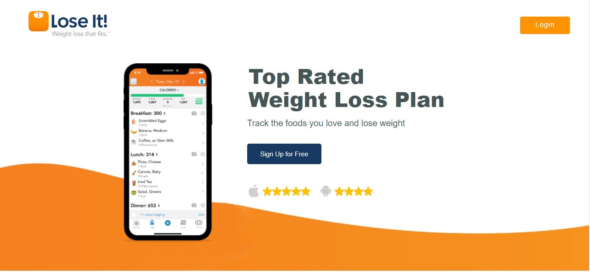
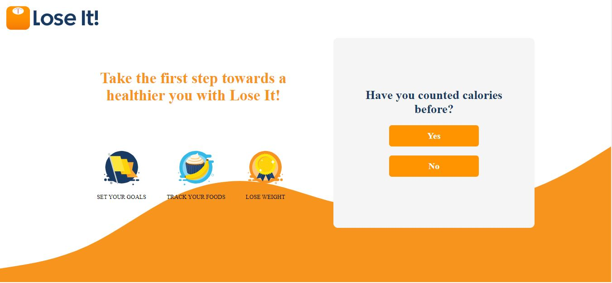
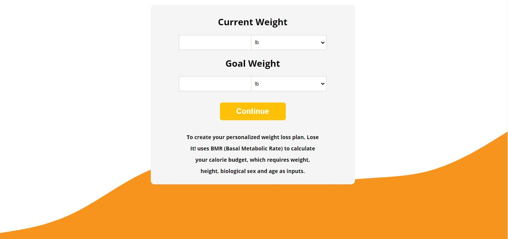
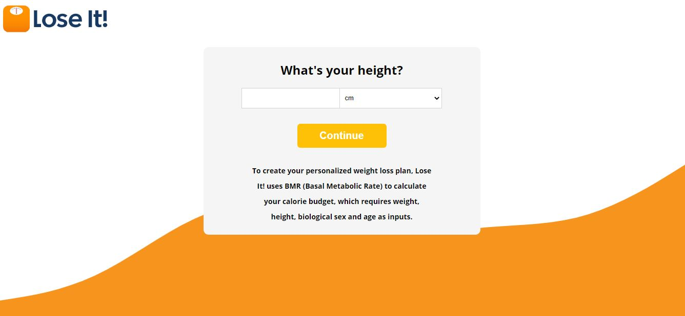
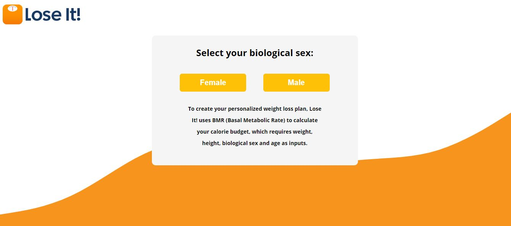
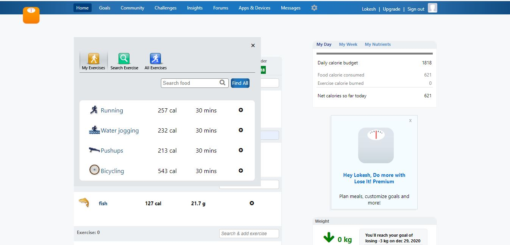
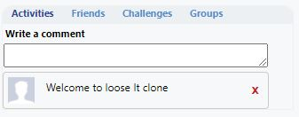
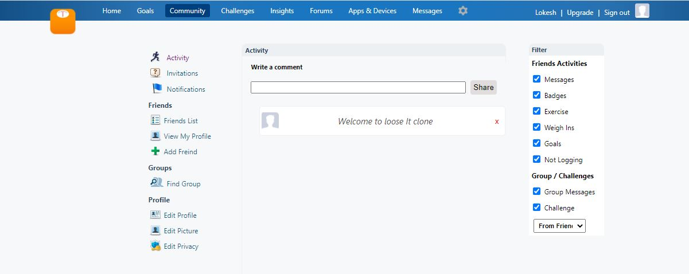
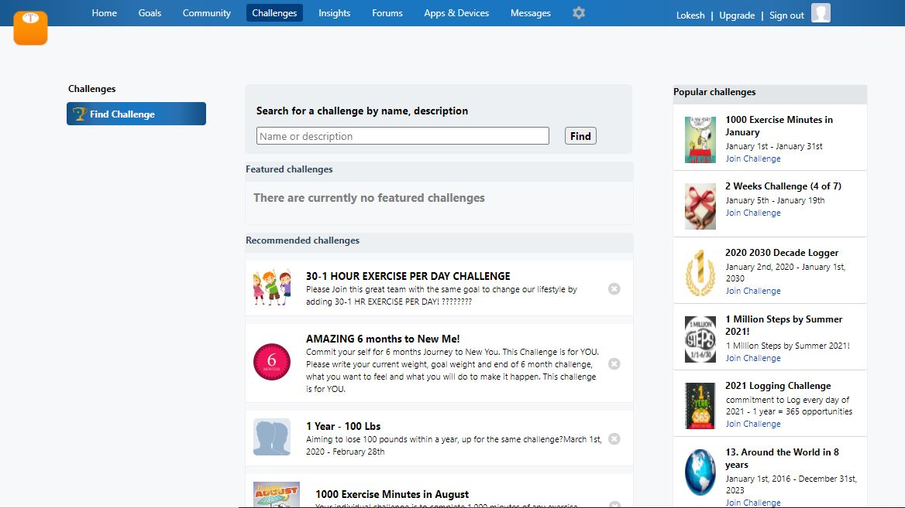
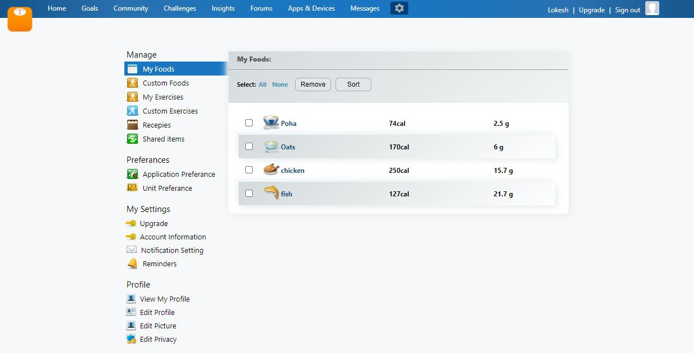

# Silicon
# Cloned "loseit.com".
**Loseit.com** is a web-application which is used to track daily Calorie count and helps you to loose weight.

 ## Tech Stacks Used:
- **HTML**
- **CSS**
- **JavaScript**
- **ES6**
   
- NOTE: Most of our pages are dynamic, and we stored some data in local storage which can be accesible by user and also  allows the user to create his custom data which got stored in local storage.

### Walkthrough to the project:
1. 	Open index.html file on your browser
2.  This is the landing page which gives you the overview of website, and most of the part of this page are static. 
    ;
3.  To proceed further user need to click "Sign up for free" or "Login" button.
4.  When user try to login, first he will come to this page, if he click on "Yes" he will directly redirect to home page    (User's Dashboard) of the application, and if he click "No" he will move to next page to calculate Calorie.
Note:- User needs to provide some data like weight, height etc in order to get the calories count and other information in dashboard, So please provide data by clicking on the No button present on this page.
    ;
5.  In this page user is asked to enter his weight in pounds or kg, and also user enters the "Goal weight" which he want to achive. If the user kept any of the input field empty he will not be able to proceed further.
    ;
6.  In this page user has to enter his height in cm or m.
    ;
7.  In this page user has to select his SEX (male / female).
    ;
8.  In this page user need to enter his date of birth and click on continue.
    ;
9.  In this page, Whatever the input user has given in previous pages, according to that he will get the calorie count and how much calorie he need to loose to achive his required goal weight and how much time is required.  
once the user click on "Home" button he will redirect to his dashboard.
    ;
10. This is the user's dashboard where he can add some food in breakfast, lunch, dinner by clicking on "Add Food" button or by searching in search bar, he will get the details of food and calorie count of that food. We have already added some list of food in our local storage so user can select from that list.
    ;
11. In the same way user can also select Exercise by clicking "Add Exercise" button or by searching in search bar, he will get details of all exercises with calories burned on that particular exercises, we have already added list of exercises  in local storage.
    ;
12. According to calorie intake via Food and calorie burned through exercise user can see his Net calorie count of the day.
    ;
13. In the meanwhile User can also track how much weight he lost or gained by entering current weight in box.
    ;
14. user can also write comment if he wants. and also toggle to different sections to connect with friends or any groups.
    ;
15. This is the Community page where user can see all the comments and at the same time he can add or delete some comments.
    ;
16. User can also add his friend by clicking "Add Friend" link, it will redirect to user's Facebook page.
17. This is the Challenge page where user can see all the recommended challenges and Find some challenges by entering keyword in search bar.
    ;
18. This is the Setting page of application where user can see his food in "My Food"  section and sort his food  alphabatecally and also delete some food if he wants. whatever the action user perform here will be reflected to his dashboard.
    ;
19. In the same way user can see his added Exercise in "My Exercise"  section and perform same operation.
    ;
20. User can click "Sign Out" link to sign out from the application.

  

## End Notes
- In this project we cloned most of the dynamic part of website and we achive near to perfect results, and few of the   pages we left static. 

## Team Members and Contributors

 👤 **Lokesh Nimje**

- Github: [lokeshnimje](https://github.com/lokeshnimje)
- Linkedin: [Lokesh Nimje](https://www.linkedin.com/in/lokesh-nimje-46841ba9/)
- Email: lokesh.nimje@gmail.com
 
  👤 **Ashish Bhagat**
  
- Github: [ashishbhagat123](https://github.com/ashishbhagat123)
- Linkedin: [Ashish Bhagat](https://www.linkedin.com/in/ashish-bhagat-3b2bb1142/)
- Email: abhagat629@gmail.com

 👤 **K V Mohan Reddy**

- Github: [kristipati123]
- Linkedin: 
- Email: 